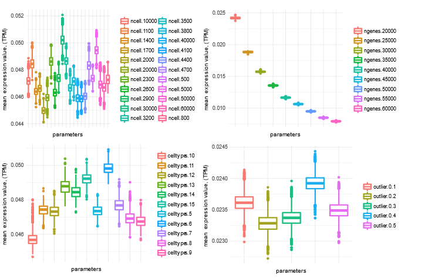
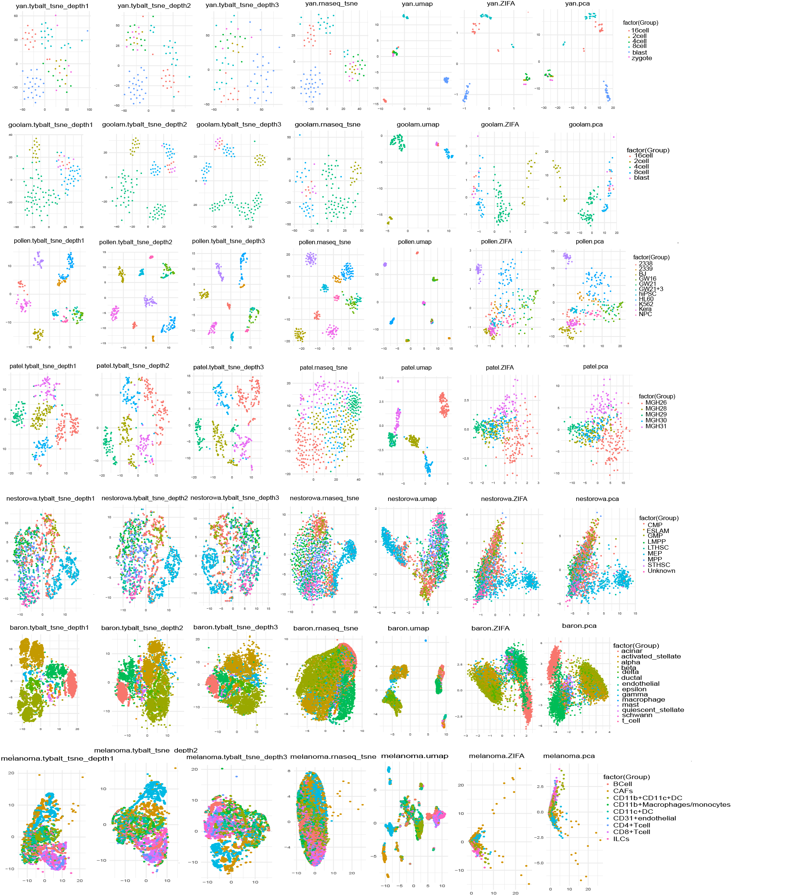
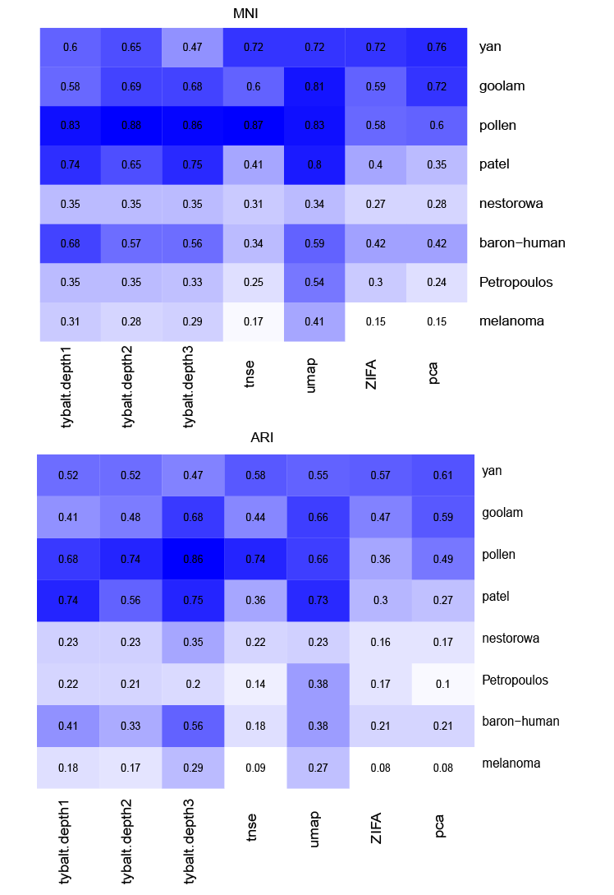
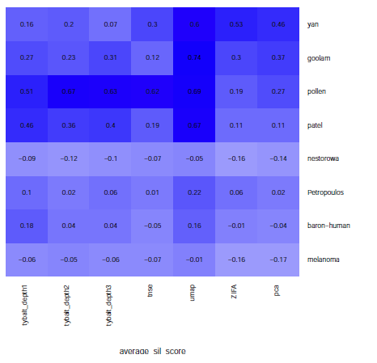
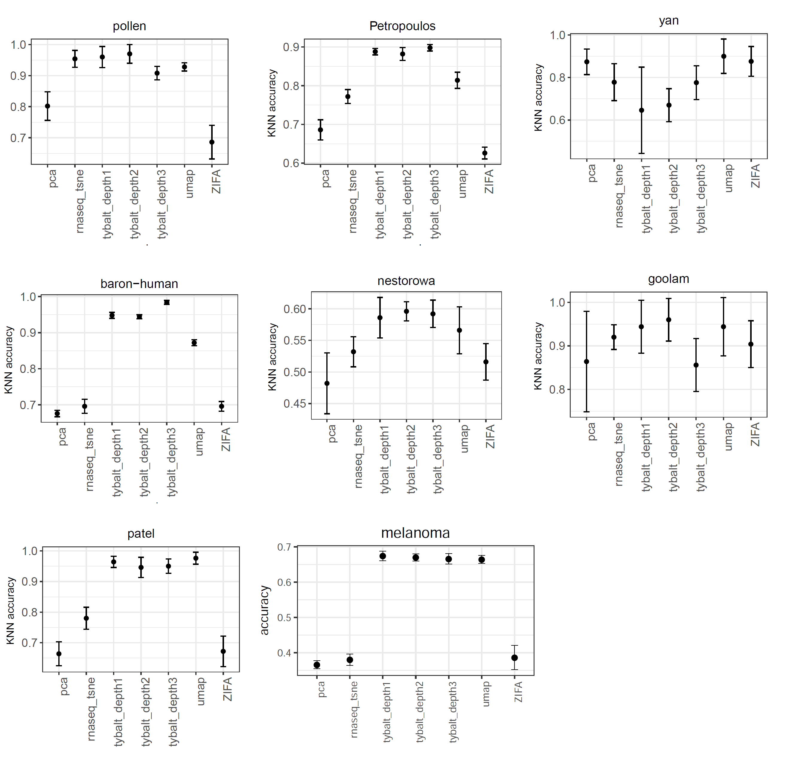

## Aim 1: Develop proof-of-concept unsupervised deep learning methods for single cell transcriptomic data from the HCA.

### Proposed work

The _objective of this aim_ is to implement and test approaches to build deep generative models, such as VAEs [@arxiv:1312.6114] and GANs [@arxiv:1406.2661], from HCA single cell RNA-seq data.

Single cell data pose unique opportunities, but also challenges, for deep neural network algorithms.
Many cells are often assayed, and many observations are needed to use deep learning effectively.
However, transcript abundance estimates for each cell are generally subject to more error than bulk samples.

In our experience with generative deep learning [@doi:10.1101/159756 @doi:10.1101/174474] it can be difficult to predict optimal parameters in advance.
We will perform a grid search over VAE architectures and hyperparameters to identify suitable options.
We will evaluate zero-inflated loss among more traditional loss functions, as Chris Probert noted potential benefits on our proposal's GitHub repository [@url:https://github.com/greenelab/czi-rfa/issues/11] @doi:10.1186/s13059-015-0805-z @arxiv:1610.05857 @doi:10.1186/s13059-017-1188-0].
This process will identify a subset of parameters and architectures that are worth exploring further for single cells.

We will also develop data augmentation for single cell RNA-seq data, as no such approaches exist yet for transcriptomes.
To understand data augmentation, imagine scanned pathology slides.
Each slide may be prepared and scanned with a subtly different orientation or magnification.
A deep learning method may identify these measurement differences, or there may be too few slides to train a good model.
Applying arbitrary rotations, zooms, and other irrelevant transformations increases the effective amount of training data and reduces the model's propensity to learn such noise.

We plan to use fast abundance estimates for RNA-seq [@doi:10.1038/nmeth.4197 @doi:10.1038/nbt.3519] to perform data augmentation for transcriptomes.
Multiple resamples or subsamples of reads during transcript abundance estimation can capture uncertainty in the data, akin to arbitrary rotations.
Therefore, we plan to collaborate with Rob Patro's laboratory (Collaborative Network) to implement these and related approaches.
We posit that genomic data augmentation will improve latent feature generalization by separating biological from technical features and increasing the effective sample size during training.

We will select high-quality models by choosing those that minimize both reconstruction loss and KL divergence [@arxiv:1312.6114].
We will evaluate resulting models for their applicability to rheumatic disease and their suitability for latent space arithmetic (see: Evaluation).

### Results

#### VAE test on simulated single cell datasets

##### 1. Simulation data generation: 

Simulated single cell data was generated by splatter [@doi:10.1186/s13059-017-1305-0]. 

Parameters used:
* nCells - The number of cells to simulate: 500 - 5000
* nGenes - The number of genes to simulate: 20000 - 60000
* nGroups - The number of cell types: 5 - 15
* outlier - probability of a gene that is an expression outlier:  0.1 - 0.5
* default parameter is ncells = 600, nGenes = 20000, cell types = 5, batchsize = 1

Simulation statistics under different parameters:

Figure 1: Distribution of mean expression level of simulated genes across samples under different simulated parameters.

##### 2. Visualization of simulated single cell data using VAE_depth2 (2 hidden layer), VAE_depth1 (1 hidden layer), t-SNE and PCA under different parameters

To see if different methods can recover cell types, we compared the 2D visualizations on simulated datasets.
2-layer VAE performs much better to differentiate different cell types when comparing with 1-layer VAE.
The performance of VAE and t-SNE is similar and much better than PCA, but with the increase of outlier genes, 2-layer VAE is more resistant to noise.

Figure 2: 2 - layer VAE is more resistant to outlier. 2D visualization of simulated single cell data from different outlier parameters ( 0 - 0.5).

##### 3. Performance evaluation of different simulation parameters

Clustering performance was measured by normalized mutual information (NMI).
NMI is an normalization of the Mutual Information (MI, measures the dependence of two random variables). It is a measurement to determine the quality of clustering, which is between 0 (no mutual information) and 1 (perfect correlation).

Figure 3: Performance comparison among VAE, t-SNE and PCA under different simulation parameters.

#### VAE performance on real single cell datasets

##### 1. real single cell datasets:

To evaluate the performance of VAE and the other dimension reduction approaches, we selected 8 real single cell datasets with true cell type labels.

| dataset | ncells | ngenes | tissue | organism | cell types | Accesion number | Platform | celltype annotation | Citation |
| ------- | ------ | ------ | ------ | -------- | --------- | --------- | ------------------ | -------------------------------------- | ------- |
| yan | 90 | 20214 | Embryo Devel | human | 6 | GSE36552 | Illumina HiSeq 2000 | from different embryonic developmental time points | [@doi:10.1038/nsmb.2660] |
| goolam | 124 | 41428 | Embryo Devel | mouse | 5 | E-MTAB-3321 | | from different embryonic developmental time points | [@doi:10.1016/j.cell.2016.01.047] |
| pollen | 301 | 23730 | Developing Cerebral Cortex | human | 11 | SRP041736 | Illumina HiSeq 2000 | from different celllines | [@doi:10.1038/nbt.2967] |
| patel | 430 | 5948 | Glioblastoma | human | 12 | GSE57249 | Illumina HiSeq 2000 | from five primary glioblastomas | [@doi:10.1126/science.1254257] |
| nestorowa | 1656 | 4773 | Glioblastoma | human | 12 | GSE81682 | Illumina HiSeq 2500 | defined by sorting | [@doi:10.1182/blood-2016-05-716480] |
| Petropoulos | 1529 | 26178 | Embryo Devel | human | 6 | E-MTAB-3929 | Illumina HiSeq 2000 | defined by developmental stages | [@doi:10.1016/j.cell.2016.08.009] |
| HCA melanoma data | 6639 | 22489 | Lymph node | mouse | 9 | HCA release | Smart-seq2 |  | https://preview.data.humancellatlas.org/ |
| baron-human | 8569 | 20125 | Pancreas | human | 14 | GSE84133 | Illumina HiSeq 2500 | from expression profiles and cell origin |  [@doi:10.1016/j.cels.2016.09.002] | 

##### 2. 2-dimensional projection of real single cell data based on differnt structure of VAE: VAE_depth3 (3 hidden layer), VAE_depth2 (2 hidden layer), VAE_depth1 (1 hidden layer), t-SNE, ZIFA, UMAP and PCA

We tested the performance of VAE and another 4 methods (t-SNE [@doi:10.1118/1.3267037], ZIFA [@doi:10.1186/s13059-015-0805-z], UMAP [@arxiv:1802.03426 @doi:10.1101/298430] and PCA [@doi:10.1002/wics.101]) on these real datasets with different number of cells, genes and cell types. 
Figure 4 shows the 2-D visulization of the real single cell datasets. 
PCA and ZIFA generally perform better when number of cells is small, but with the increase of number of cells, VAE better differentiates different cell types.
Increase of VAE depth does not significantly change the performance for real single cell datasets, but for the simulated data we analyzed above, VAE with higher depth is more resistant to noise and performs better with small number of cells.

Figure 4: 2D Visualization of real single cell data using VAE_depth3 (3 hidden layer), VAE_depth2 (2 hidden layer), VAE_depth1 (1 hidden layer), t-SNE, ZIFA, UMAP and PCA.

##### 3. Performance evaluation

Evaluation of model performance is based on three different types of metrics: clustering based, average silhouette score and knn-based.

*Clustering based approach*: k-means clustering was performed based on the latent space, the model performance was measured by NMI and ARI. 

Figure 5:  Performance comparison among VAE, t-SNE, ZIFA, UMAP and PCA based on k-means. For dataset with fewer cells, the performance of t-SNE, umap, ZIFA and PCA is better than VAE. VAE and umap outperforms t-SNE, ZIFA and PCA whith increase number of cells. 

*Average silhouette score*: average silhouette score measures how well each points lies with its own cluster, which indicates the separability of each inidividual cluster. 
The value of average silluetee score is between -1 to 1, with 1 means the cluster is far away from its neighboring clusters.

Figure 6: Performance comparison among VAE, t-SNE, ZIFA, UMAP and PCA based on Average silhouette score. 
The average silluetee score does not differ too much for different aproaches. 
The performance of UMAP is generally better than the other approaches.

*knn-based*: for knn-based approach, we used k-nearest neighbor algorithm to learn the pattern based on the low dimensional latent space, then the performance of classifier was measured by 5-fold cross validation. 
The performance of VAE is generally better than the other approaches for majority of the real datasets.

Figure 7: Performance comparison VAE, t-SNE, ZIFA, UMAP and PCA based on k-nearest neighbor algorithm.

#### Data augmentation

Data augmentation is a way to reduce overfitting on models by increasing the amount of training data using information only in the current training set. 
In images, data augmentation can be obtained by arbitrary rotations, zooms, and other irrelevant transformations of images to increase the amount of training data, which allows a deep learning model to capture the differences from the data and reduces the model's propensity to learn noise. 
The same concept also applies to single-cell transcriptomes. 
We hypothesized that genomic data augmentation will improve latent feature generalization by separating biological from technical features and increasing the effective sample size during training.

We performed data augmentation based on HCA melanoma dataset. 
We down sampled the melanoma dataset to test the method stability.
The dataset was bootstrapped with 100, 500, 1000 and 2000 cells. 
We expected data augmentation will contribute more for small number of cells rather than large number of cells.
Salmon (version 0.8.1) [@doi:10.1038/nmeth.4197] was used to do the transcript abundance quantification and we resampled the reads by 2x, 5x and 10x times to capture the uncertainty in the data. 

Figure 7 and 8 show the performance of data augmentation under different conditions. 
K-means and Knn based performance both indicate data augmentation works well in small number of samples (100 and 500 cells), but does not contribute too much in a large sample size (2000).

Figure 8: K-means based performance for data augmentation on HCA melanoma dataset. The dataset was bootstrapped with 100, 500, 1000 and 2000 cells. Reads were resampled by 2x, 5x and 10x times to capture the uncertainty in the data.

Figure 9: KNN based performance for data augmentation on HCA melanoma dataset. The dataset was bootstrapped with 100, 500, 1000 and 2000 cells. Reads were resampled by 2x, 5x and 10x times to capture the uncertainty in the data.

