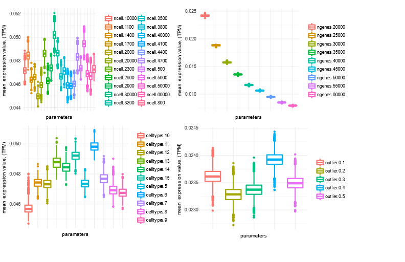
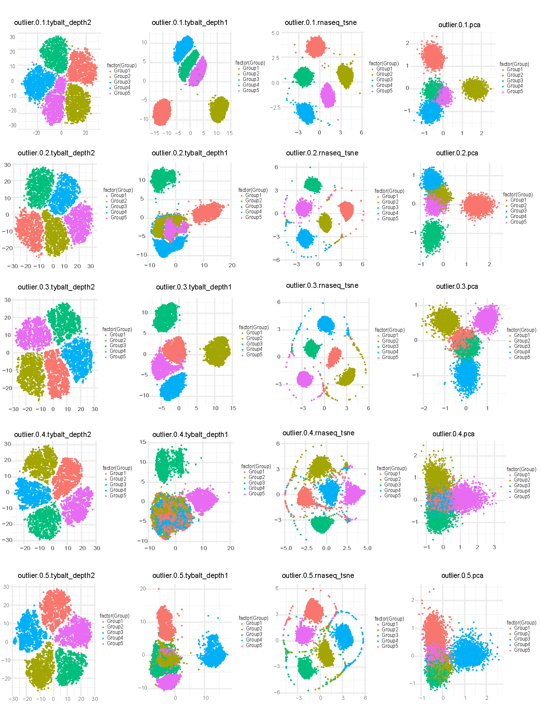
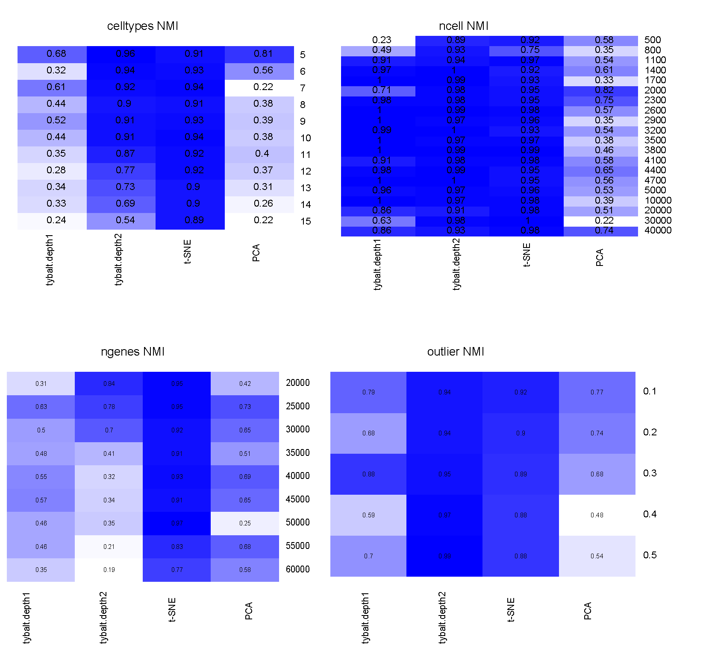

## Aim 1: Develop proof-of-concept unsupervised deep learning methods for single cell transcriptomic data from the HCA.

### Proposed work

The _objective of this aim_ is to implement and test approaches to build deep generative models, such as VAEs [@arxiv:1312.6114] and GANs [@arxiv:1406.2661], from HCA single cell RNA-seq data.

Single cell data pose unique opportunities, but also challenges, for deep neural network algorithms.
Many cells are often assayed, and many observations are needed to use deep learning effectively.
However, transcript abundance estimates for each cell are generally subject to more error than bulk samples.

In our experience with generative deep learning [@doi:10.1101/159756 @doi:10.1101/174474] it can be difficult to predict optimal parameters in advance.
We will perform a grid search over VAE architectures and hyperparameters to identify suitable options.
We will evaluate zero-inflated loss among more traditional loss functions, as Chris Probert noted potential benefits on our proposal's GitHub repository [@url:https://github.com/greenelab/czi-rfa/issues/11] @doi:10.1186/s13059-015-0805-z @arxiv:1610.05857 @doi:10.1186/s13059-017-1188-0].
This process will identify a subset of parameters and architectures that are worth exploring further for single cells.

We will also develop data augmentation for single cell RNA-seq data, as no such approaches exist yet for transcriptomes.
To understand data augmentation, imagine scanned pathology slides.
Each slide may be prepared and scanned with a subtly different orientation or magnification.
A deep learning method may identify these measurement differences, or there may be too few slides to train a good model.
Applying arbitrary rotations, zooms, and other irrelevant transformations increases the effective amount of training data and reduces the model's propensity to learn such noise.

We plan to use fast abundance estimates for RNA-seq [@doi:10.1038/nmeth.4197 @doi:10.1038/nbt.3519] to perform data augmentation for transcriptomes.
Multiple resamples or subsamples of reads during transcript abundance estimation can capture uncertainty in the data, akin to arbitrary rotations.
Therefore, we plan to collaborate with Rob Patro's laboratory (Collaborative Network) to implement these and related approaches.
We posit that genomic data augmentation will improve latent feature generalization by separating biological from technical features and increasing the effective sample size during training.

We will select high-quality models by choosing those that minimize both reconstruction loss and KL divergence [@arxiv:1312.6114].
We will evaluate resulting models for their applicability to rheumatic disease and their suitability for latent space arithmetic (see: Evaluation).

### Results

#### VAE test on simulated single cell datasets
#### 1. Simulation data generation: 
Simulated single cell data was generated by splatter [@doi:10.1186/s13059-017-1305-0]. 

Parameters used:
* nCells - The number of cells to simulate: 500 - 5000
* nGenes - The number of genes to simulate: 20000 - 6000
* nGroups - The number of celltypes: 5 - 15
* outlier - probability of a gene that is an expression outlier:  0.1 - 0.5
* default parameter is ncells = 600, nGenes = 20000, celltypes = 5, batchsize = 1

Simulation statistics under different parameters:

Figure 1: Mean expression level of simulated genes

#### 2. Visualization of simulated single cell data using VAE_depth2 (2 hidden layer), VAE_depth1 (1 hidden layer), t-SNE and PCA under different parameters

  To see if different methods can recover cell types, we compared the 2D visualizations on simulated datasets. 2-layer VAE performs much better to differentiate different cell types when comparing with 1-layer VAE. The performance of VAE and t-SNE is similar and much better than PCA, but with the increase of outlier genes, 2-layer VAE is more resistant to noise.

Figure 2: 2 - layer VEA is more resistant to outlier. 2D visualization of simulated single cell data from different outlier parameters (0.1 - 0.5).

#### 3. Performance evaluation of different simulation parameters
Clustering performance was measured by normalized mutual information (NMI).

Figure 3: Performance comparison among VAE, t-SNE and PCA under different simulation parameters. 
