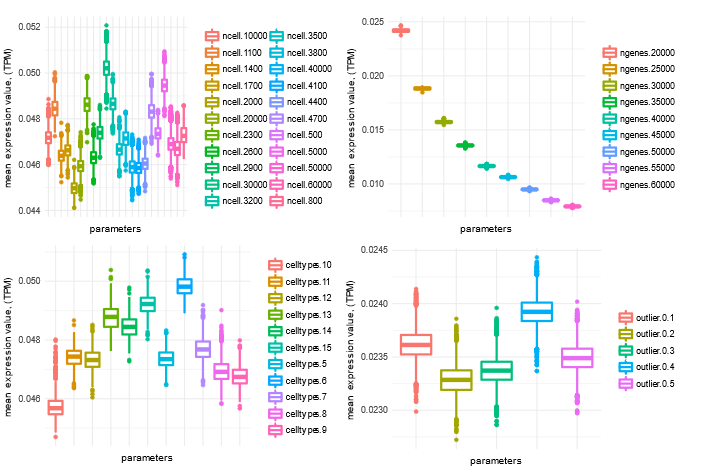
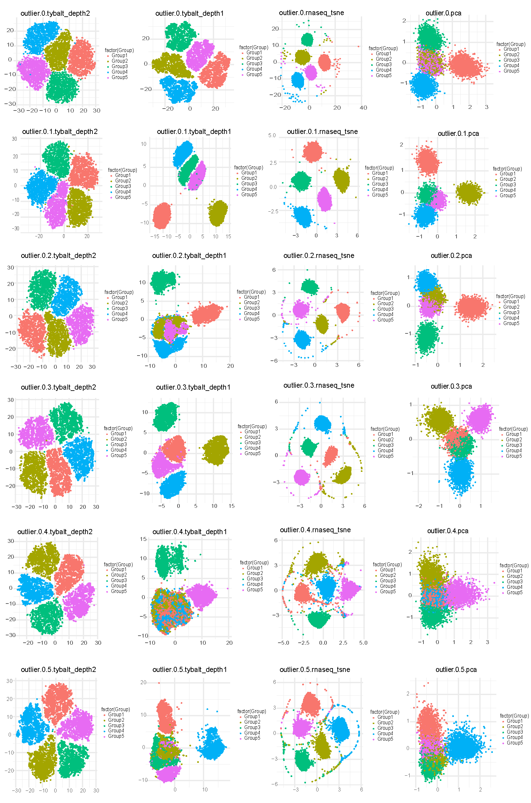

---
author-meta:
- Casey S. Greene
date-meta: '2018-03-12'
keywords:
- single cell
- latent space
- variational autoencoder
- generative adversarial networls
- deep learning
lang: en-US
title: 'Progress Report: Genome-wide hypothesis generation for single-cell expression
  via latent spaces of deep neural networks'
...

<small><em>
This manuscript was automatically generated
from [greenelab/czi-hca-report@f4263d2](https://github.com/greenelab/czi-hca-report/tree/f4263d283d80100a4e86624066d5efedfdd0b9c7)
on March 12, 2018.
</em></small>

## Authors

+ **Casey S. Greene** 
    {height="13px" width="13px"}
    [0000-0001-8713-9213](https://orcid.org/0000-0001-8713-9213)
    · {height="13px" width="13px"}
    [cgreene](https://github.com/cgreene)
    · {height="13px" width="13px"}
    [greenescientist](https://twitter.com/greenescientist) 
  <small>
     Department of Systems Pharmacology and Translational Therapeutics, Perelman School of Medicine, University of Pennsylvania; Childhood Cancer Data Lab, Alex's Lemonade Stand Foundation
     · Funded by Grant TBD
  </small>

## Abstract {.page_break_before}

We wrote an application for the [Chan Zuckerberg Initiative's Collaborative Computational Tools RFA](https://chanzuckerberg.com/wp-content/uploads/2017/03/RFA-Computational-Tools.pdf).
Our application was recommended for funding.
We are writing our progress report as we go.
This repository contains the report.
Please feel free to file a [GitHub Issue](https://github.com/greenelab/czi-hca-report/issues) to ask a question.
Some elements of this report are expected to also be written up via a published manuscript.
In the event that we write a manuscript, we will begin from this report.
Authorship will be determined in accordance with [ICMJE guidelines](http://www.icmje.org/recommendations/browse/roles-and-responsibilities/defining-the-role-of-authors-and-contributors.html).

## Introduction

Currently this contains text describing our project from our [initial proposal](https://github.com/greenelab/czi-rfa/blob/master/proposal.md).

The Human Cell Atlas (HCA) aims to provide a comprehensive map of all types of human cells. Connecting that map to disease states, which will be key to the CZI's mission of curing or managing all diseases in the next eighty years, will require us to see how these cell types change during aging, during disease processes, or in the presence of drugs. Ideally, we'd be able to apply a transformation to the HCA's reference map to predict and study these states.

Certain types of deep neural networks can generate hypothetical data by learning and decoding a lower dimensional latent space. An ideal latent space enables arithmetic operations that use data to produce realistic output for novel transformations. For example, FaceApp [@11SweunvY] can modify a picture of an individual to produce an image of the subject at an older age, with a different expression, or of a different gender.

The overall objective of this proposal is to determine how unsupervised deep neural network models can best be trained on single cell expression data from the HCA and the extent to which such models define biological latent spaces that capture disease states and targeted perturbations. The rationale is that latent space arithmetic for single cell transcriptomes would enable researchers to use predict how the expression of every gene would change in each HCA-identified cell type in numerous conditions including after drug treatment, in the context of a specific genetic variant, with a specific disease, or a combination of these and other factors.

### Summary

Certain deep neural networks can generate hypothetical data by learning and decoding a lower dimensional latent space.
This latent space enables arithmetic operations that produce realistic output for novel transformations.
This allows users to generate hypothetical images [@mSTbr0cw] and to interpolate protein localizations through the cell-cycle [@zBCcUQOM].
An accessible example of latent space transformations comes from FaceApp [@11SweunvY], which modifies a picture of an individual to produce an image of the subject at an older age, with a different expression, or of a different genders.

Our _overall objective_ is to determine how unsupervised deep neural network models can best be trained on single cell expression data from the Human Cell Atlas (HCA) and the extent to which such models define biological latent spaces that capture disease states and targeted perturbations.
The _rationale_ is that latent space arithmetic for genomic data would enable researchers to predict how the expression of every gene would change in each HCA-identified cell type after drug treatment, in the context of a specific genetic variant, with a specific disease, or a combination of these and other factors.

### Prior Contributions / Preliminary Results

We previously developed neural-network based methods for unsupervised integration of transcriptomic data [@1CFhfCyWN @Hlprh8TG @BXscBoDB].
We now build to Generative Adversarial Networks (GANs) and Variational Autoencoders (VAEs) which have a track record of defining meaningful latent spaces for images.
We adapted GANs to generate realistic individuals under a differential privacy framework [@fbIH12yd] and built VAEs over bulk transcriptomic data with the goal of describing a biologically-relevant latent space [@aWn0df1m].
Here, we will apply these unsupervised deep learning methods to single cell transcriptomic data and incorporate novel data augmentation approaches for genomics.
We also bring workflow automation experience to the HCA community [@Qh7xTLwz].

## Aim 1: Develop proof-of-concept unsupervised deep learning methods for single cell transcriptomic data from the HCA.

### Proposed work

The _objective of this aim_ is to implement and test approaches to build deep generative models, such as VAEs [@NLVTJ9Lj] and GANs [@dXnSD8tJ], from HCA single cell RNA-seq data.

Single cell data pose unique opportunities, but also challenges, for deep neural network algorithms.
Many cells are often assayed, and many observations are needed to use deep learning effectively.
However, transcript abundance estimates for each cell are generally subject to more error than bulk samples.

In our experience with generative deep learning [@fbIH12yd @aWn0df1m] it can be difficult to predict optimal parameters in advance.
We will perform a grid search over VAE architectures and hyperparameters to identify suitable options.
We will evaluate zero-inflated loss among more traditional loss functions, as Chris Probert noted potential benefits on our proposal's GitHub repository [@ufUaIy3V] @13Q8I0ueY @6Dv4X61k @zALrucGv].
This process will identify a subset of parameters and architectures that are worth exploring further for single cells.

We will also develop data augmentation for single cell RNA-seq data, as no such approaches exist yet for transcriptomes.
To understand data augmentation, imagine scanned pathology slides.
Each slide may be prepared and scanned with a subtly different orientation or magnification.
A deep learning method may identify these measurement differences, or there may be too few slides to train a good model.
Applying arbitrary rotations, zooms, and other irrelevant transformations increases the effective amount of training data and reduces the model's propensity to learn such noise.

We plan to use fast abundance estimates for RNA-seq [@vrqQcFyx @12KZMHMQl] to perform data augmentation for transcriptomes.
Multiple resamples or subsamples of reads during transcript abundance estimation can capture uncertainty in the data, akin to arbitrary rotations.
Therefore, we plan to collaborate with Rob Patro's laboratory (Collaborative Network) to implement these and related approaches.
We posit that genomic data augmentation will improve latent feature generalization by separating biological from technical features and increasing the effective sample size during training.

We will select high-quality models by choosing those that minimize both reconstruction loss and KL divergence [@NLVTJ9Lj].
We will evaluate resulting models for their applicability to rheumatic disease and their suitability for latent space arithmetic (see: Evaluation).

### Results

#### VAE test on simulated single cell datasets
#### 1. Simulation data generation: 
Simulated single cell data was generated by splatter [@117yS2Kkv]. 

Parameters used:
* nCells - The number of cells to simulate: 500 - 5000
* nGenes - The number of genes to simulate: 20000 - 60000
* nGroups - The number of celltypes: 5 - 15
* outlier - probability of a gene that is an expression outlier:  0.1 - 0.5
* default parameter is ncells = 600, nGenes = 20000, celltypes = 5, batchsize = 1

Simulation statistics under different parameters:

Figure 1: Distribution of mean expression level of simulated genes across samples under different simulated parameters.

#### 2. Visualization of simulated single cell data using VAE_depth2 (2 hidden layer), VAE_depth1 (1 hidden layer), t-SNE and PCA under different parameters

To see if different methods can recover cell types, we compared the 2D visualizations on simulated datasets.
2-layer VAE performs much better to differentiate different cell types when comparing with 1-layer VAE.
The performance of VAE and t-SNE is similar and much better than PCA, but with the increase of outlier genes, 2-layer VAE is more resistant to noise.

Figure 2: 2 - layer VAE is more resistant to outlier. 2D visualization of simulated single cell data from different outlier parameters ( 0 - 0.5).

#### 3. Performance evaluation of different simulation parameters
Clustering performance was measured by normalized mutual information (NMI).
NMI is an normalization of the Mutual Information (MI, measures the dependence of two random variables). It is a measurement to determine the quality of clustering, which is between 0 (no mutual information) and 1 (perfect correlation).

Figure 3: Performance comparison among VAE, t-SNE and PCA under different simulation parameters. 

## Aim 2: Generate a benchmark dataset of harmonized public data to evaluate the extent to which HCA cell types capture rheumatic disease biology.

The HCA's partnership with the Immunological Genome Project (immgenH) will provide single-cell gene expression-based immunocyte phenotyping at an unprecedented resolution.
A compendium comprised of bulk gene expression data from autoimmune/rheumatic diseases is exceptionally well-suited to evaluating the disease relevance of these immunocyte data.
The _objective of this aim_ is to build and share real and simulated benchmark datasets to evaluate the quality of the cell-type signatures.
This will allow CZI to evaluate techniques, including VAEs and other methods, for defining cell-type-specific expression signatures from the HCA's single-cell datasets by measuring their ability to decompose bulk, whole-tissue autoimmune/rheumatic disease data.

We will generate simulated bulk datasets drawn from HCA-identified cell types by combining their expression profiles at different proportions.
We will also build a multi-tissue autoimmune/rheumatic disease compendium from existing public datasets that we have curated (currently more than 12,000 samples).
This compendium includes samples from patients with systemic lupus erythematosus (SLE), sarcoidosis, and inflammatory bowel disorders among many other diseases.
Such a compendium lets us determine the extent to which HCA-derived cell type signatures capture disease-relevant information in a way that matches previous literature.
For instance, we expect to detect higher proportions of activated macrophages in lupus nephritis samples than controls [@2f2lADmF].

These bulk compendia (simulated and real data) will enable HCA participants (computational-method and molecular-assay developers) to directly compare approaches where we expect their most immediate translational impact: application to existing datasets to explain disease-relevant phenomena via a single-cell perspective.

### Results

TBD.

## References {.page_break_before}

<!-- Explicitly insert bibliography here -->

